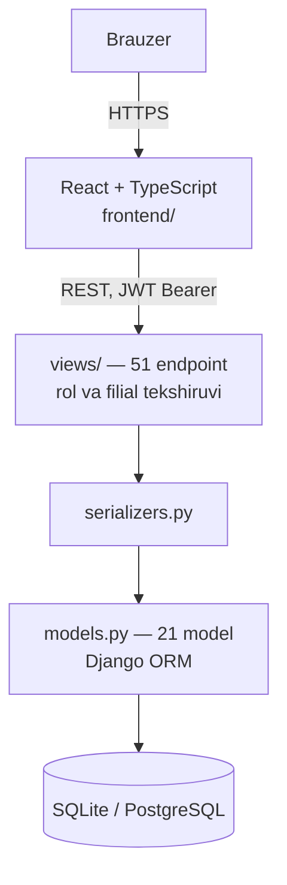
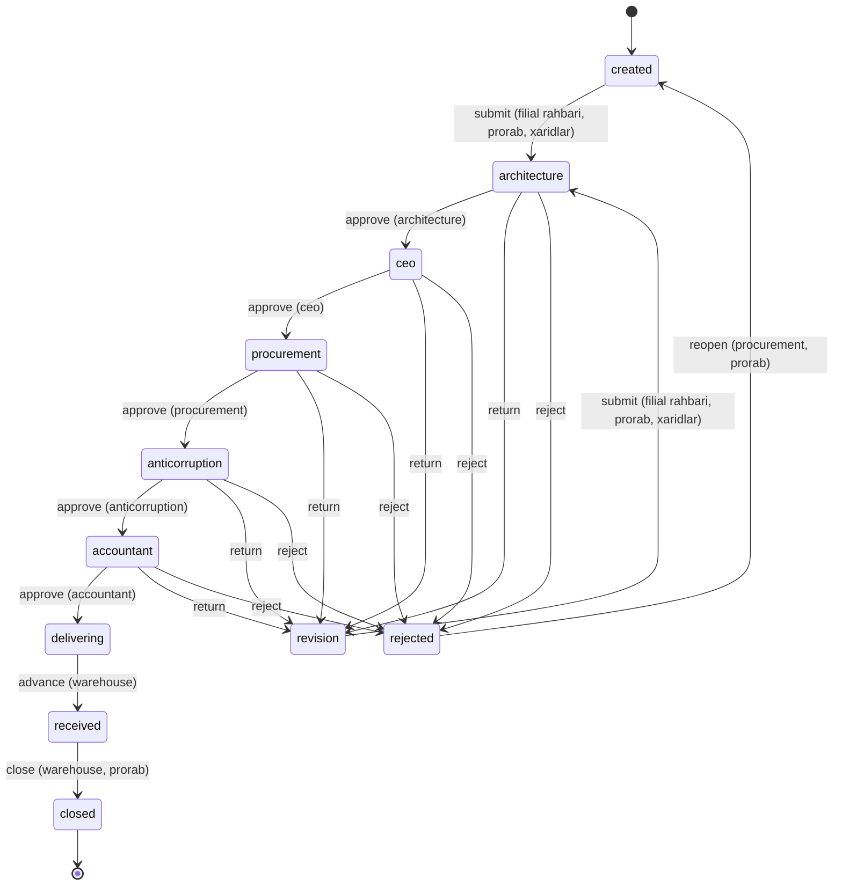

# E-Ombor


Qurilish tashkilotlari uchun ombor, hujjat aylanishi va moliya boshqaruvi
platformasi. Filiallar, qurilish obyektlari va omborlar bo'yicha
markazlashtirilgan hisob; xarid so'rovi rahbariyat tasdig'idan to'lovgacha
bitta zanjirda kuzatiladi.

**Jonli demo:** https://e-ombor-uz.vercel.app

| | |
|---|---|
| Backend | Django 4.2 + DRF, JWT autentifikatsiya, 51 endpoint, 22 model |
| Frontend | React 19 + TypeScript + Vite, TanStack Query, Tailwind v4 |
| Baza | SQLite (dev) / PostgreSQL (prod) |
| Testlar | 143 ta (`python manage.py test api`) |

> **Tizim mantiqi to'liq bayon qilingan:** [`docs/TIZIM.md`](docs/TIZIM.md) —
> rol matritsasi, filial izolyatsiyasi qoidasi, hujjat oqimi, ombor va moliya
> mantiqi.

---

## Arxitektura



Frontend uch qatlamli: `api/` (axios) → `hooks/` (TanStack Query) → `pages/`.
Har bir domen shu qolipni takrorlaydi.

---

## Rollar va ruxsatlar

Rollar alohida jadval emas — `User.roles` bu JSON ro'yxat, mumkin bo'lgan
qiymatlar `User.ROLES` konstantasida. Bitta foydalanuvchida bir nechta rol
bo'lishi mumkin.

| Rol | Vazifasi |
|---|---|
| `admin` | Tizim administratori — hamma narsaga kiradi |
| `ceo` | Boshqaruv raisi — hujjatni yakuniy tasdiqlaydi |
| `architecture` | Arxitektura va rejalashtirish — birinchi tasdiq |
| `procurement` | Xaridlar boshqarmasi |
| `accountant` | Buxgalter |
| `warehouse` | Omborchi |
| `prorab` | Prorab — obyektdan zayavka beradi |
| `branch_manager` | Filial rahbari — xarid so'rovini boshlaydi |
| `anticorruption` | Korrupsiyaga qarshi nazorat — to'lovdan oldingi tekshiruv, hech nima yoza olmaydi |

**O'zgartirish huquqi** (o'qish barcha rollarga ochiq, filial doirasida):

| Soha | Kim yozadi |
|---|---|
| Filial, material, ombor, manzil | `admin` |
| Yetkazib beruvchi | `admin`, `procurement` |
| Qurilish obyekti | `admin`, `branch_manager`, `architecture` |
| Xarid buyurtmasi | `admin`, `procurement`, `branch_manager` |
| Shartnoma | `admin`, `procurement` |
| Hisob-faktura | `admin`, `accountant`, `procurement` |
| To'lov | `admin`, `accountant` |
| Ombor harakati va zaxira | `admin`, `warehouse` |
| Hujjatni tahrirlash/o'chirish | Muallifi, `admin`, `procurement`, `branch_manager` |
| Foydalanuvchilar | `admin` |

### Filial izolyatsiyasi

| Foydalanuvchi | Ko'radigan ma'lumot |
|---|---|
| Admin | Hammasi |
| Markaziy rol (`ceo`, `procurement`, `anticorruption`) | Hammasi — qaror uchun butun manzara kerak |
| Zanjir bosqichi (`architecture`, `accountant`) | Hammasi — o'z navbatidagi hujjatni ko'rishi shart |
| Filiali bor xodim (shu jumladan `warehouse`) | Faqat o'z filiali |
| Filiali yo'q hisob | Hech nima |

Bu **faqat ko'rish** doirasi — yozish huquqi yuqoridagi jadval bilan alohida
tekshiriladi. Omborchi bu yerda filialga bog'langan bo'lib qoladi: u tovarni
jismonan qabul qiladi.

Chegaralash ro'yxat va tafsilot endpointlarida bir xil ishlaydi — id ni
taxmin qilib begona filial yozuviga kirib bo'lmaydi.

---

## Hujjat oqimi

`Document` — o'n bir holatli avtomat. Har bir o'tish aniq rol talab qiladi.



Rad etish (`reject`) va tuzatishga qaytarishda (`return`) sabab majburiy.
`return` hujjatni `revision` ga tushiradi: u tahrirlanadi va qayta
yuborilganda zanjir arxitekturadan boshlanadi. `advance` esa xarid qatorlarini
ombor qoldig'iga kirim qiladi. Har o'tish `DocumentApproval` yozuvi va audit
logi qoldiradi. `admin` har qanday o'tishni bajara oladi.

Hujjat bo'yicha yozishma alohida: `documents/<id>/comments/` — izoh muzlagan
hujjatda ham yoziladi va tahrirlanmaydi.

---

## Tezkor boshlash

### Talablar

- Python 3.11+
- Node.js 20+
- (ixtiyoriy) PostgreSQL 14+

### Backend

```bash
cd backend

python3 -m venv venv
source venv/bin/activate
pip install -r requirements.txt

python manage.py migrate
python manage.py createsuperuser     # admin panel uchun
python manage.py runserver 0.0.0.0:3000
```

| Manzil | Nima |
|---|---|
| `http://localhost:3000/api/` | API |
| `http://localhost:3000/api/docs/` | Swagger (interaktiv hujjat) |
| `http://localhost:3000/api/schema/` | OpenAPI sxemasi |
| `http://localhost:3000/admin/` | Django admin paneli |

### Frontend

```bash
cd frontend

npm install
npm run dev       # Vite dev server
```

Boshqa komandalar: `npm run build` (tsc + vite build), `npm run lint`,
`npm run preview`.

API manzili `.env` dagi `VITE_API_URL` orqali beriladi. Standart qiymat
`/api` — Vite dev server so'rovni backendga uzatadi (`vite.config.ts`
dagi `server.proxy`), shu sabab bir xil Wi-Fi'dagi boshqa qurilmada ham
ishlaydi.

### Backend `.env`

```env
DEBUG=True
SECRET_KEY=your-secret-key-here
DB_NAME=eombor
DB_USER=postgres
DB_PASSWORD=postgres
DB_HOST=localhost
DB_PORT=5432
```

Ildizdagi `setup_and_run.sh` backendni bir komanda bilan ko'taradi
(`./setup_and_run.sh`, `stop`, `status`).

---

## Demo ma'lumotlar

```bash
cd backend
python manage.py seed_demo_data      # to'liq demo to'plam
python manage.py flush_demo_data     # tozalash — user, rol va filial qoladi
python manage.py flush_demo_data --dry-run   # nima o'chishini ko'rsatadi
```

`flush_demo_data` foydalanuvchilar, ularning rollari va filiallarni saqlaydi.
Filial `User.branch` uchun zarur — u o'chsa xodimlar filialsiz qolib, hech
narsa ko'rmay qoladi.

Demo loginlar:

| Email | Parol | Rol |
|---|---|---|
| `admin@eombor.uz` | `Admin123!` | admin |
| `ceo@eombor.uz` | `Ceo12345!` | ceo |
| `architecture@eombor.uz` | `Arch12345!` | architecture |
| `procurement@eombor.uz` | `Procure123!` | procurement |
| `accountant@eombor.uz` | `Account123!` | accountant |
| `warehouse@eombor.uz` | `Warehouse123!` | warehouse |
| `prorab@eombor.uz` | `Prorab123!` | prorab |
| `branch@eombor.uz` | `Branch123!` | branch_manager |
| `control@eombor.uz` | `Control123!` | anticorruption |
| `site.engineer@eombor.uz` | `Engineer123!` | architecture + procurement |

---

## API

To'liq va har doim dolzarb hujjat — **Swagger:** `/api/docs/`
(sxema `/api/schema/`). Quyida domenlar bo'yicha xarita.

| Domen | Bazaviy manzil | Yozish huquqi |
|---|---|---|
| Auth | `/api/auth/` — `register`, `login`, `refresh`, `logout`, `user`, `change-password` | — |
| Foydalanuvchilar | `/api/users/` | `admin` |
| Hujjatlar | `/api/documents/` + `{id}/workflow/`, `{id}/archive/`, `{id}/files/`, `export/` | muallif, `admin`, `procurement`, `branch_manager` |
| Xarid | `/api/purchase-orders/` | `admin`, `procurement`, `branch_manager` |
| Ma'lumotnoma | `/api/materials/`, `/api/warehouses/`, `/api/branches/`, `/api/addresses/` | `admin` |
| Yetkazib beruvchilar | `/api/suppliers/` | `admin`, `procurement` |
| Obyektlar | `/api/sites/` | `admin`, `branch_manager`, `architecture` |
| Ombor | `/api/inventory/`, `/api/stock-movements/`, `/api/inventory/export/` | `admin`, `warehouse` |
| Moliya | `/api/contracts/`, `/api/invoices/`, `/api/payments/`, `/api/invoices/{id}/payments/` | `admin`, `accountant`, `procurement` |
| Zayavkalar | `/api/production-requests/` | filial xodimlari |
| Murojaatlar | `/api/tickets/`, `/api/tickets/export/` | filial xodimlari |
| Hisobot | `/api/dashboard/`, `/api/analytics/overview/` | — |
| Bildirishnoma | `/api/notifications/`, `{id}/read/`, `read-all/` | egasi |
| Audit | `/api/audit-logs/` | — |

Batafsil qoidalar (nima nimaga sabab bo'ladi, qanday tekshiriladi) →
[`docs/TIZIM.md`](docs/TIZIM.md).

---

## Testlar

```bash
cd backend
python manage.py test api
```

| Fayl | Qamrov |
|---|---|
| `api/tests_stock_movements.py` | Ombor harakatlari, satr qulflash, yetarsiz qoldiq (30 test) |
| `api/tests_*.py` (9 ta fayl) | Auth oqimi, bo'sh baza, rol matritsasi, nazorat rolining yozish taqiqi va SoD, tasdiqlash zanjiri, hujjat muzlatilishi, izohlar, tuzatishga qaytarish, qabul, filial izolyatsiyasi, raqam generatsiyasi, filtrlar (113 test) |

Har bir tekshiruv **kutilgan** xulqni tasdiqlaydi.
Yiqilgan test — tuzatilishi kerak bo'lgan xato, testni moslashtirish emas.

Frontendda test runner sozlanmagan.

---

## Loyiha tuzilishi

```
e-ombor/
├── backend/
│   ├── api/
│   │   ├── workflow.py                  # tasdiqlash zanjiri — yagona manba
│   │   ├── models.py                    # 21 model
│   │   ├── serializers.py
│   │   ├── views/                      # 51 endpoint, domen bo'yicha
│   │   ├── roles.py  scope.py          # kim kim / kim nimani ko'radi
│   │   ├── urls.py
│   │   ├── admin.py
│   │   ├── migrations/
│   │   ├── management/commands/
│   │   │   ├── seed_demo_data.py        # demo to'plam
│   │   │   └── flush_demo_data.py       # tozalash (user/rol/filial qoladi)
│   │   ├── tests_stock_movements.py
│   │   └── tests_*.py                  # 9 ta test fayli
│   ├── e_ombor_backend/                 # settings, urls, wsgi/asgi
│   ├── manage.py
│   └── requirements.txt
├── frontend/
│   └── src/
│       ├── api/                         # axios chaqiruvlari + query kalitlari
│       ├── hooks/                       # TanStack Query hook'lari
│       ├── pages/                       # domen sahifalari
│       ├── layouts/                     # Layout, Sidebar, Header
│       ├── routs/                       # router.tsx, ProtectedRoute
│       ├── stores/                      # Zustand (authStore)
│       ├── lib/                         # axios, queryClient, permissions.ts
│       └── types/
├── docs/
│   └── TIZIM.md                         # tizim mantiqi to'liq bayoni
├── setup_and_run.sh
└── README.md
```

---

## Xavfsizlik

- **JWT** — access 60 daqiqa, refresh 7 kun. Rotatsiya yoqilgan: har
  `refresh/` chaqiruvi yangi refresh beradi, eskisi blacklistga tushadi.
  Bir tokenni ikki marta ishlatib bo'lmaydi.
- **Rolga asoslangan ruxsat** — 8 rol, yozish amallari server tomonda
  tekshiriladi. Frontenddagi `permissions.ts` faqat UI uchun nusxa,
  himoya emas.
- **Filial izolyatsiyasi** — ro'yxat va tafsilot endpointlarida bir xil.
- **Huquq oshirishdan himoya** — `/auth/register/` orqali rol yoki filial
  biriktirib bo'lmaydi; profil tahrirlash rolni o'zgartira olmaydi.
- **Fayl yuklash** — 10MB chegara, faqat `.pdf`, `.xlsx`, `.xls`, `.jpg`,
  `.jpeg`, `.png`.
- **Audit logging** — yozish amallari kim/qachon/nima/IP bilan qayd etiladi.
- **CORS** — `django-cors-headers`, ruxsat etilgan manbalar `settings.py` da.

> Ishlab chiqarishga chiqarishdan oldin: `DEBUG=False`, `ALLOWED_HOSTS` ni
> aniq belgilash, `SECRET_KEY` ni muhit o'zgaruvchisidan olish va DRF
> throttling sozlash kerak — hozir bularning hech biri sozlanmagan.

---

## Bajarilgan va rejadagi ishlar

- [x] Rol asosidagi dashboard va navigatsiya
- [x] Hujjat aylanishi — filial rahbaridan omborgacha 11 holatli tasdiqlash zanjiri
- [x] Ombor moduli — kirim/chiqim/ko'chirish, qoldiq nazorati, kam zaxira ogohlantirishi
- [x] Obyekt va filial kuzatuvi
- [x] Moliya — shartnoma, hisob-faktura, to'lov zanjiri
- [x] CSV eksport (hujjat, inventar, murojaat)
- [x] Audit log va bildirishnomalar
- [x] API shartnoma testlari (113 test)
- [ ] Frontend testlari
- [ ] DRF throttling va production sozlamalari
- [ ] e-imzo integratsiyasi — raqamli imzo bilan tasdiqlash
- [ ] 1C integratsiyasi
- [ ] Excel eksport (hozircha faqat CSV)
- [ ] Docker & CI/CD

---

## Litsenziya

E-Ombor — tashkilot ichki foydalanish uchun.
