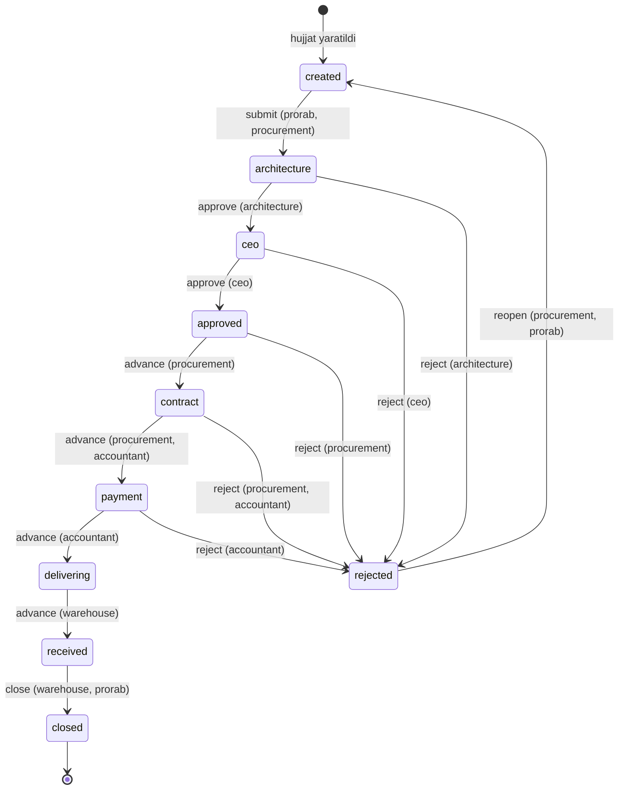

# E-Ombor — tizim qanday ishlaydi

Bu hujjat platformaning ishlash mantiqini bir joyda bayon qiladi: kim nima
qila oladi, hujjat qanday yo'ldan o'tadi, ma'lumot qanday chegaralanadi va
nima tekshirilgan. Har bir da'vo `backend/api/tests_api_contract.py` va
`backend/api/tests_stock_movements.py` dagi testlar bilan qo'llab-quvvatlangan
(jami 75 ta test).

---

## 1. Arxitektura

```
Brauzer
   │  HTTPS
   ▼
React + TypeScript (Vite)          frontend/
   │  REST, JWT Bearer
   ▼
Django REST Framework              backend/api/
   │  Django ORM
   ▼
SQLite (dev) / PostgreSQL (prod)
```

Frontend uch qatlamli: `api/` (axios chaqiruvlari) → `hooks/` (TanStack Query)
→ `pages/`. Har bir domen shu qolipni takrorlaydi.

Backend bitta `api` ilovasidan iborat: `models.py` (21 model), `serializers.py`,
`views.py` (50 endpoint), `urls.py`.

---

## 2. Ma'lumotlar modeli

Modellar to'rt guruhga bo'linadi.

**Tashkiliy tuzilma**
`Branch` (filial) — ildiz. `ConstructionSite` (qurilish obyekti) va
`Warehouse` (ombor) filialga tegishli. `User` ham filialga bog'langan —
ma'lumot ko'rish doirasi shundan kelib chiqadi.

**Ma'lumotnoma bazasi**
`Material` (katalog), `Supplier` (yetkazib beruvchi), `Address` (manzil).
Bular filialga bog'lanmagan, butun tizim uchun umumiy.

**Hujjat oqimi**
`Document` — markaziy obyekt. Unga `DocumentApproval` (tasdiqlash tarixi),
`DocumentFile` (biriktirilgan fayllar), `PurchaseOrder` → `PurchaseOrderItem`,
`Contract`, `Invoice` → `Payment` bog'lanadi. `Contract` va `Invoice` —
`OneToOne`, ya'ni bitta hujjatda bitta shartnoma va bitta hisob-faktura.

**Operatsion yozuvlar**
`InventoryItem` (ombordagi qoldiq, `warehouse + material` bo'yicha unikal),
`StockMovement` (kirim/chiqim/ko'chirish), `ProductionRequest` (zayavka),
`Ticket` (murojaat), `Notification`, `AuditLog`.

---

## 3. Autentifikatsiya

Email + parol → JWT juftligi. `User` modelida `username` yo'q,
`USERNAME_FIELD = 'email'`.

| Parametr | Qiymat |
|---|---|
| Access token | 60 daqiqa |
| Refresh token | 7 kun |
| Rotatsiya | Yoqilgan — har `refresh/` chaqiruvi yangi refresh beradi |
| Eski token | Rotatsiyadan keyin blacklistga tushadi |

Amaliy oqibati: bir refresh tokenni ikki marta ishlatib bo'lmaydi. Ikkinchi
urinish 401 qaytaradi. `logout/` refreshni blacklistga qo'shadi va
idempotent — allaqachon bekor qilingan token ham 200 beradi.

Frontendda `src/lib/axios.ts` 401 ni ushlab, refreshni bir marta bajaradi
(parallel so'rovlar bitta `refreshPromise` ni kutadi) va so'rovni takrorlaydi.
Refresh ham muvaffaqiyatsiz bo'lsa — majburiy logout.

**Ro'yxatdan o'tish.** `/auth/register/` ochiq, lekin yangi hisob **rolsiz va
filialsiz** tug'iladi. Rol va filialni faqat admin beradi. Bu ataylab: aks
holda istalgan odam o'ziga `admin` rolini so'rovda yozib yubora olardi.

---

## 4. Rollar va ruxsatlar

Rollar alohida jadval emas — `User.roles` bu JSON ro'yxat, mumkin bo'lgan
qiymatlar `User.ROLES` konstantasida. Bitta foydalanuvchida bir nechta rol
bo'lishi mumkin.

| Rol | Vazifasi |
|---|---|
| `admin` | Tizim administratori — hamma narsaga kiradi |
| `ceo` | Boshqaruv raisi — hujjatni yakuniy tasdiqlaydi |
| `architecture` | Arxitektura va rejalashtirish — birinchi tasdiq |
| `procurement` | Xaridlar boshqarmasi |
| `accountant` | Buxgalter |
| `warehouse` | Omborchi |
| `prorab` | Prorab — obyektdan zayavka beradi |
| `branch_manager` | Filial rahbari |

### Yozish huquqi matritsasi

O'qish barcha autentifikatsiyadan o'tgan foydalanuvchilarga ochiq (filial
chegarasi doirasida). Quyidagi jadval **o'zgartirish** huquqini ko'rsatadi.
Manba: `backend/api/views.py` boshidagi rol to'plamlari.

| Soha | Kim yozadi |
|---|---|
| Filial, material, ombor, manzil | `admin` |
| Yetkazib beruvchi | `admin`, `procurement` |
| Qurilish obyekti | `admin`, `branch_manager`, `architecture` |
| Xarid buyurtmasi | `admin`, `procurement` |
| Shartnoma | `admin`, `procurement` |
| Hisob-faktura | `admin`, `accountant`, `procurement` |
| To'lov | `admin`, `accountant` |
| Ombor harakati va zaxira | `admin`, `warehouse` |
| Hujjatni arxivlash | `admin`, `procurement`, `branch_manager` |
| Hujjatni tahrirlash/o'chirish | Muallifi, `admin`, `procurement`, `branch_manager` |
| Foydalanuvchilar | `admin` |

Frontend `src/lib/permissions.ts` da shu to'plamlarning nusxasini saqlaydi.
Bu **xavfsizlik chorasi emas** — server har bir so'rovni mustaqil tekshiradi.
Maqsad: bosilganda 403 beradigan tugmani umuman ko'rsatmaslik. Rol to'plami
o'zgarsa, ikkala joyni ham yangilash kerak.

---

## 5. Filial izolyatsiyasi

Bu tizimning eng muhim qoidasi. `views.py: branch_scope()` uchta holatni
ajratadi:

| Foydalanuvchi | Ko'radigan ma'lumot |
|---|---|
| Admin (`admin` roli yoki `is_staff`) | Hammasi |
| Filiali bor xodim | Faqat o'z filiali |
| Filiali yo'q hisob | Hech nima (bo'sh ro'yxat) |

Uchinchi qator muhim: yangi ro'yxatdan o'tgan hisobda filial yo'q, va u
hech qanday ish ma'lumotini ko'rmaydi. Admin unga filial va rol bergandan
keyingina tizim ochiladi.

Chegaralash **ro'yxat va tafsilot endpointlarida bir xil** qo'llaniladi —
id ni taxmin qilib begona filial yozuviga kirib bo'lmaydi (404 qaytadi).
Bu hujjat, ombor, obyekt, zaxira, shartnoma, hisob-faktura, to'lov, zayavka
va fayl yuklashga tegishli.

Murojaatlar (`Ticket`) biroz boshqacha: filiali bor xodim butun filial
murojaatlarini, filialsiz esa faqat o'zi yaratganini ko'radi.

---

## 6. Hujjat oqimi

`Document` — o'nta holatli avtomat. Har bir o'tish uchun aniq rol talab
qilinadi (`views.py: WORKFLOW_RULES`).



`admin` har qanday o'tishni bajara oladi.

Qoidalar:

- Holatda mavjud bo'lmagan amal → 400 (`"Bu holatda ushbu amal mavjud emas"`).
- Roli mos kelmasa → 403.
- **Rad etishda sabab majburiy** — izohsiz `reject` 400 qaytaradi.
- Har o'tish `DocumentApproval` yozuvi va audit logi qoldiradi.
- Hujjat muallifi va filialdagi tegishli rollar bildirishnoma oladi.

**Hujjat raqami** `XR-2026-0001` ko'rinishida (`XR` — xarid so'rovi, `SH` —
shartnoma, `INV` — invoice). Raqam mavjud eng katta qiymatdan davom etadi,
sanoqdan emas — yozuv o'chirilsa ham raqam qayta ishlatilmaydi.

---

## 7. Ombor mantiqi

`StockMovement` uch turda bo'ladi va har biri `InventoryItem` qoldig'ini
o'zgartiradi. Amal `transaction.atomic()` ichida, satr `select_for_update()`
bilan qulflanadi.

| Tur | Ta'siri |
|---|---|
| `IN` | Qoldiq oshadi; yozuv bo'lmasa yaratiladi |
| `OUT` | Qoldiq kamayadi; yetarli bo'lmasa 400 va o'zgarish bekor |
| `TRANSFER` | Manbadan ayiriladi, maqsadga qo'shiladi |

Muhim tafsilotlar:

- `TRANSFER` da omborlar **id bo'yicha tartiblab** qulflanadi — parallel
  qarama-qarshi ko'chirishlarda deadlock bo'lmasligi uchun.
- Omborchi (admin emas) faqat **o'z filiali** omborlari bilan ishlaydi;
  manba ham, maqsad ham shu filialda bo'lishi shart.
- Qoldiq minimal chegaraga tushsa (`min_quantity`, belgilanmagan bo'lsa 10),
  filialdagi omborchi, filial rahbari va adminga ogohlantirish yuboriladi.
- Yangi `InventoryItem` yaratish ham `IN` harakatini tug'diradi, shuning
  uchun u ham omborchi/admin huquqini talab qiladi.

---

## 8. Moliya zanjiri

```
Document ──1:1── Contract ──1:N── Invoice ──1:N── Payment
```

`Payment` yaratilganda `Invoice.paid_amount` avtomatik yangilanadi va
`payment_status` qayta hisoblanadi:

| Shart | Holat |
|---|---|
| `paid_amount == 0` | `unpaid` (to'lanmagan) |
| `0 < paid_amount < total_amount` | `partial` (qisman) |
| `paid_amount >= total_amount` | `paid` (to'liq) |

Tekshiruvlar: to'lov summasi noldan katta bo'lishi, va `paid_amount + amount`
hisob-faktura summasidan oshmasligi kerak. Aks holda 400.

---

## 9. Bildirishnomalar va audit

**Bildirishnoma** foydalanuvchiga tegishli va faqat egasiga ko'rinadi.
Begona bildirishnomani o'qilgan deb belgilash 404 beradi. Yuboriladigan
hodisalar: hujjat yaratilishi, holat o'zgarishi, kam zaxira, yangi murojaat,
to'lov qayd etilishi, ro'yxatdan o'tish.

**Audit log** yozish amallarini qayd etadi: kim, qachon, qaysi model, qaysi
obyekt, qanday tafsilot, qaysi IP. Ko'rish doirasi filial bilan cheklangan
(admin hammasini ko'radi, filialsiz foydalanuvchi faqat o'z izlarini).
Serializer amal nomlarini o'zbekchaga o'giradi va id o'rniga obyekt nomini
ko'rsatadi; o'chirilgan obyekt nomi audit tafsilotidan olinadi.

---

## 10. Hisobot va eksport

`GET /api/dashboard/` — filial doirasidagi umumiy holat: hujjatlar soni,
kutilayotgan tasdiqlar, kam qolgan zaxiralar, so'nggi hujjatlar va
murojaatlar, to'lov yakuni, obyekt byudjeti.

`GET /api/analytics/overview/` — kesimlar: hujjatlar turi va holati bo'yicha,
murojaatlar ustuvorligi va holati bo'yicha, muddati o'tgan hisob-fakturalar,
kam zaxiralar, so'nggi audit yozuvlari.

CSV eksport uchta bo'limda: `documents/export/`, `inventory/export/`,
`tickets/export/`. Eksport ham filial doirasida ishlaydi va ro'yxat
filtrlarini qabul qiladi.

---

## 11. Ma'lumot hayoti va test

Ikkita boshqaruv komandasi:

```bash
python manage.py seed_demo_data     # to'liq demo to'plam + demo loginlar
python manage.py flush_demo_data    # tranzaksion va ma'lumotnoma yozuvlarini o'chiradi
python manage.py flush_demo_data --dry-run   # nima o'chishini ko'rsatadi
```

`flush_demo_data` **foydalanuvchilar, ularning rollari va filiallarni
saqlaydi** — filial `User.branch` uchun zarur, u o'chsa xodimlar filialsiz
qolib, hech narsa ko'rmay qoladi.

Testlar:

```bash
python manage.py test api
```

| Fayl | Qamrov |
|---|---|
| `tests_stock_movements.py` | Ombor harakatlari, qulflash, yetarsiz qoldiq (30 test) |
| `tests_api_contract.py` | Auth oqimi, bo'sh baza, rol matritsasi, filial izolyatsiyasi, raqam generatsiyasi, filtrlar (45 test) |

`tests_api_contract.py` da har bir tekshiruv **kutilgan** xulqni tasdiqlaydi.
Yiqilgan test — tuzatilishi kerak bo'lgan xato, testni moslashtirish emas.

---

## 12. Ma'lum cheklovlar

Quyidagilar hozircha bajarilmagan va keyingi bosqichga qoladi:

1. **Ma'lumotnoma bazasi rollari qat'iy.** Material, ombor va manzilni faqat
   admin o'zgartira oladi. Agar amalda buni omborchi ham qilishi kerak bo'lsa,
   `views.py` dagi `AdminOnlyWrite` ni tegishli rol to'plamiga almashtirish
   yetarli (frontenddagi `REFERENCE_DATA_ROLES` bilan birga).

2. **Ombor ma'lumotnomasi filialga bog'lanmagan.** `Material` butun tizim
   uchun umumiy; filialga xos katalog kerak bo'lsa, model o'zgartirilishi
   kerak.

3. **Hujjat oqimi orqaga qaytmaydi.** `rejected` dan `created` ga qaytish
   bor, lekin oraliq holatdan bir qadam orqaga qaytish yo'q.

4. **Frontendda test yo'q.** Rol darvozalari faqat backendda avtomatik
   tekshiriladi; frontend nusxasi qo'lda moslashtiriladi.

5. **Fayl yuklash antivirus tekshiruvisiz.** Faqat kengaytma (`.pdf`,
   `.xlsx`, `.xls`, `.jpg`, `.jpeg`, `.png`) va hajm (10MB) tekshiriladi.
