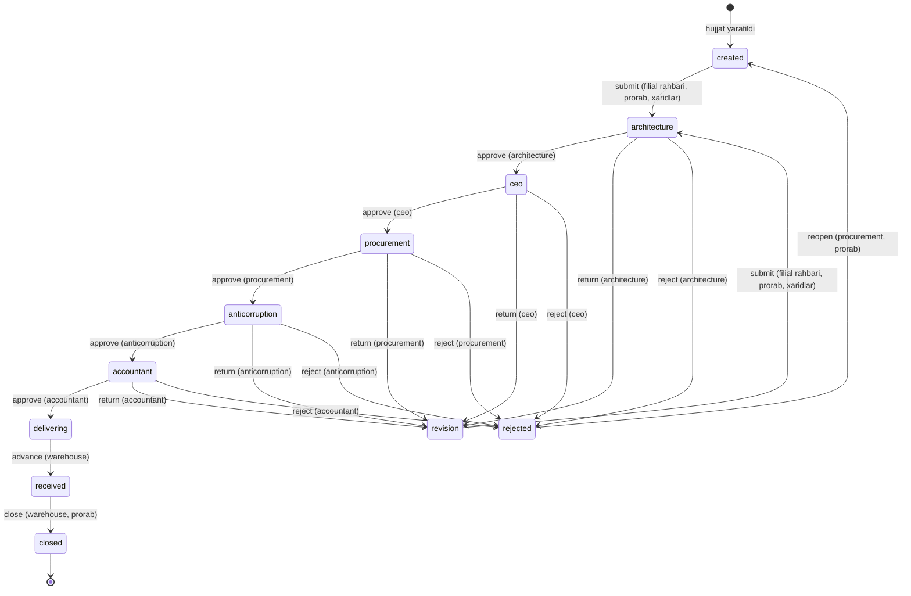

# E-Ombor — tizim qanday ishlaydi

Bu hujjat platformaning ishlash mantiqini bir joyda bayon qiladi: kim nima
qila oladi, hujjat qanday yo'ldan o'tadi, ma'lumot qanday chegaralanadi va
nima tekshirilgan. Har bir da'vo `backend/api/tests_api_contract.py` va
`backend/api/tests_stock_movements.py` dagi testlar bilan qo'llab-quvvatlangan
(jami 143 ta test).

---

## 1. Arxitektura

```
Brauzer
   │  HTTPS
   ▼
React + TypeScript (Vite)          frontend/
   │  REST, JWT Bearer
   ▼
Django REST Framework              backend/api/
   │  Django ORM
   ▼
SQLite (dev) / PostgreSQL (prod)
```

Frontend uch qatlamli: `api/` (axios chaqiruvlari) → `hooks/` (TanStack Query)
→ `pages/`. Har bir domen shu qolipni takrorlaydi.

Backend bitta `api` ilovasidan iborat: `models.py` (22 model), `serializers.py`,
`views.py` (51 endpoint), `urls.py`.

---

## 2. Ma'lumotlar modeli

Modellar to'rt guruhga bo'linadi.

**Tashkiliy tuzilma**
`Branch` (filial) — ildiz. `ConstructionSite` (qurilish obyekti) va
`Warehouse` (ombor) filialga tegishli. `User` ham filialga bog'langan —
ma'lumot ko'rish doirasi shundan kelib chiqadi.

**Ma'lumotnoma bazasi**
`Material` (katalog), `Supplier` (yetkazib beruvchi), `Address` (manzil).
Bular filialga bog'lanmagan, butun tizim uchun umumiy.

**Hujjat oqimi**
`Document` — markaziy obyekt. Unga `DocumentApproval` (tasdiqlash tarixi),
`DocumentComment` (yozishma), `DocumentFile` (biriktirilgan fayllar),
`PurchaseOrder` → `PurchaseOrderItem`, `Contract`, `Invoice` → `Payment`
bog'lanadi. `Contract` va `Invoice` — `OneToOne`, ya'ni bitta hujjatda bitta
shartnoma va bitta hisob-faktura.

**Operatsion yozuvlar**
`InventoryItem` (ombordagi qoldiq, `warehouse + material` bo'yicha unikal),
`StockMovement` (kirim/chiqim/ko'chirish), `ProductionRequest` (zayavka),
`Ticket` (murojaat), `Notification`, `AuditLog`.

---

## 3. Autentifikatsiya

Email + parol → JWT juftligi. `User` modelida `username` yo'q,
`USERNAME_FIELD = 'email'`.

| Parametr | Qiymat |
|---|---|
| Access token | 60 daqiqa |
| Refresh token | 7 kun |
| Rotatsiya | Yoqilgan — har `refresh/` chaqiruvi yangi refresh beradi |
| Eski token | Rotatsiyadan keyin blacklistga tushadi |

Amaliy oqibati: bir refresh tokenni ikki marta ishlatib bo'lmaydi. Ikkinchi
urinish 401 qaytaradi. `logout/` refreshni blacklistga qo'shadi va
idempotent — allaqachon bekor qilingan token ham 200 beradi.

Frontendda `src/lib/axios.ts` 401 ni ushlab, refreshni bir marta bajaradi
(parallel so'rovlar bitta `refreshPromise` ni kutadi) va so'rovni takrorlaydi.
Refresh ham muvaffaqiyatsiz bo'lsa — majburiy logout.

**Ro'yxatdan o'tish.** `/auth/register/` ochiq, lekin yangi hisob **rolsiz va
filialsiz** tug'iladi. Rol va filialni faqat admin beradi. Bu ataylab: aks
holda istalgan odam o'ziga `admin` rolini so'rovda yozib yubora olardi.

---

## 4. Rollar va ruxsatlar

Rollar alohida jadval emas — `User.roles` bu JSON ro'yxat, mumkin bo'lgan
qiymatlar `User.ROLES` konstantasida. Bitta foydalanuvchida bir nechta rol
bo'lishi mumkin.

| Rol | Vazifasi |
|---|---|
| `admin` | Tizim administratori — hamma narsaga kiradi |
| `ceo` | Boshqaruv raisi — hujjatni yakuniy tasdiqlaydi |
| `architecture` | Arxitektura va rejalashtirish — birinchi tasdiq |
| `procurement` | Xaridlar boshqarmasi |
| `accountant` | Buxgalter |
| `warehouse` | Omborchi |
| `prorab` | Prorab — obyektdan zayavka beradi |
| `branch_manager` | Filial rahbari — xarid so'rovini boshlaydi |
| `anticorruption` | Korrupsiyaga qarshi nazorat — to'lovdan oldingi tekshiruv |

### `is_staff` — admin bo'lishning ikkinchi yo'li

`is_staff` Django'ning standart bayrog'i va `roles` dan **mustaqil** maydon
(`models.py`, default `False`). `views.py: is_admin()` ikkalasini ham qabul
qiladi:

```python
return user.is_staff or bool(ADMIN_ROLES.intersection(user.roles or []))
```

Ya'ni `roles` bo'sh bo'lsa ham, `is_staff=True` bo'lgan hisob tizimda to'liq
admin: material qo'shadi, `/users` va audit logga kiradi, barcha filialni
ko'radi. Bu ataylab shunday — `createsuperuser` bilan yaratilgan birinchi
hisob rolsiz tug'iladi (`UserManager.create_superuser` `roles=[]` qoldiradi),
aks holda tizimga hech kim kira olmasdi.

Bayroq faqat ikki yo'l bilan yoqiladi: `createsuperuser`, yoki admin `/users`
bo'limidan qo'lda bergani. O'zini o'zi ko'tarish yopiq — ro'yxatdan o'tish
serializerida `is_staff` maydoni umuman yo'q, profil tahrirlashda esa u
`roles` bilan birga `read_only`. Buni `tests_api_contract.py` tekshiradi:
prorab o'ziga `{"roles": ["admin"], "is_staff": true}` yuborsa ham hech nima
o'zgarmaydi.

### Yozish huquqi matritsasi

O'qish barcha autentifikatsiyadan o'tgan foydalanuvchilarga ochiq (filial
chegarasi doirasida). Quyidagi jadval **o'zgartirish** huquqini ko'rsatadi.
Manba: `backend/api/views.py` boshidagi rol to'plamlari.

`admin` ustuni jadvalda yo'q — `is_admin()` har bir tekshiruvda birinchi
bo'lib `True` qaytaradi, ya'ni admin hamma katakda ✅.

| Soha | ceo | arxitektura | xaridlar | buxgalter | omborchi | prorab | filial rahbari |
|---|:-:|:-:|:-:|:-:|:-:|:-:|:-:|
| Filial, material, ombor, manzil | — | — | — | — | — | — | — |
| Yetkazib beruvchi | — | — | ✅ | — | — | — | — |
| Qurilish obyekti | — | ✅ | — | — | — | — | ✅ |
| Xarid buyurtmasi | — | — | ✅ | — | — | — | ✅ |
| Shartnoma | — | — | ✅ | — | — | — | — |
| Hisob-faktura | — | — | ✅ | ✅ | — | — | — |
| To'lov | — | — | — | ✅ | — | — | — |
| Zaxira va ombor harakati | — | — | — | — | ✅ | — | — |
| Ombor harakatini o'chirish | — | — | — | — | — | — | — |
| Hujjat yaratish | ✅ | ✅ | ✅ | ✅ | ✅ | ✅ | ✅ |
| Hujjatni tahrirlash/o'chirish | muallif | muallif | muallif | muallif | muallif | muallif | ✅ |
| Hujjatni arxivlash | — | — | ✅ | — | — | — | ✅ |
| Zayavka va murojaat | ✅ | ✅ | ✅ | ✅ | ✅ | ✅ | ✅ |
| Foydalanuvchilar | — | — | — | — | — | — | — |

*"muallif" — faqat o'zi yaratgan hujjatni; begonasini emas.*

### Nazorat roli — faqat o'qiydi

**`anticorruption` ustuni jadvalda yo'q, chunki uning hamma katagi bo'sh.**
Yozish huquqi berilgan kuzatuvchi o'zi ham jarayon qatnashchisiga aylanadi va
nazorat qiymatini yo'qotadi.

Taqiq **aktiv**: `api/permissions.py: ControlRoleReadOnly` `SAFE_METHODS` dan
boshqa hamma so'rovga 403 qaytaradi. U `settings.py` dagi
`DEFAULT_PERMISSION_CLASSES` orqali butun API yuzasiga bir joydan qo'llanadi —
har bir view'da alohida sanalsa, bittasi unutilardi va taqiq jimgina teshik
qoldirardi. DRF'da view o'z `permission_classes` ini e'lon qilsa default
almashadi, shuning uchun qo'shimcha sinf kerak bo'lgan joylar uni
`views.DEFAULT_PERMISSIONS` ustiga qo'shadi; buni test urls.py bo'yicha
tekshiradi. Ilgari himoya passiv edi — nazorat hech qaysi yozish to'plamida
yo'q edi, lekin hujjat, zayavka va murojaat yaratish hamma rolga ochiq bo'lgani
uchun u baribir yozardi.

Istisnolar `control_role_may_write = True` bilan belgilanadi:

| Endpoint | Nega |
|---|---|
| `documents/<id>/workflow/` | Nazorat o'z bosqichida qaror qabul qiladi — asosiy vazifasi. Kim qaysi amalni bajarishi baribir `WORKFLOW_RULES` bilan tekshiriladi, ya'ni bu zanjirning boshqa bosqichini ochmaydi |
| `documents/<id>/comments/` | Kuzatuvini qayd eta olmaydigan nazoratning ma'nosi qolmaydi. Izoh qaror emas: hujjat mazmunini o'zgartirmaydi, tahrirlanmaydi va muallifi bilan qoladi |
| `auth/logout/`, `auth/change-password/`, `auth/user/`, `notifications/.../read/` | O'z hisobiga tegishli, ish ma'lumoti emas — yopilsa nazorat tizimdan chiqa ham olmasdi |

**Vazifalar ajratilishi (SoD).** `anticorruption` roli zanjirning boshqa
hech qaysi roli bilan bir hisobda birlashtirilmaydi — `UserCreateSerializer` va
`UserUpdateSerializer` bunday so'rovni 400 bilan qaytaradi. Ziddiyatli rollar
ro'yxati qo'lda sanalmaydi, `workflow.py` da zanjirning o'zidan hosil bo'ladi
(`ROLES_CONFLICTING_WITH_CONTROL`), ya'ni yangi bosqich qo'shilsa tekshiruv
eskirmaydi. `is_staff` ham shu qatorda: u rol emas, lekin `is_admin()` uchun
roldan farqi yo'q.

**Xarid buyurtmasi** endi filial rahbariga ham ochiq: yangi oqimda so'rovni
u boshlaydi, va material qatorlarisiz so'rovning mazmuni bo'lmaydi.

Uch qator izoh talab qiladi. **Hujjat yaratish** ochiq: oqim shu bilan
boshlanadi va uni kim boshlashi keyingi bosqichdagi rol tekshiruvi bilan
ajratiladi, yaratish huquqi bilan emas. **Ombor harakati** esa umuman
o'chirilmaydi: `urls.py` da faqat `stock-movements/` ro'yxat-yaratish yo'li
bor, tafsilot endpointi yo'q. Ya'ni qayd kiritilgach, uni hech kim — hatto
admin ham — API orqali o'chira olmaydi. Xato kiritilgan harakat teskari
harakat bilan tuzatiladi, tarix esa buzilmaydi. **Hujjatni tahrirlash**da esa
`DOCUMENT_MANAGE_ROLES` faqat admin va filial rahbaridan iborat: xaridlar
bo'limi begona hujjatni o'zi tuzatmaydi — kamchilikni ko'rsa filial rahbariga
aytadi, tuzatishni u kiritadi. Xaridlarning ta'siri zanjirdagi `procurement`
bosqichidagi `approve`/`reject` da qoladi. Admin esa "muallif" cheklovidan
ozod, chunki u shu to'plamda.

Frontend `src/lib/permissions.ts` da shu to'plamlarning nusxasini saqlaydi.
Bu **xavfsizlik chorasi emas** — server har bir so'rovni mustaqil tekshiradi.
Maqsad: bosilganda 403 beradigan tugmani umuman ko'rsatmaslik. Rol to'plami
o'zgarsa, ikkala joyni ham yangilash kerak.

---

## 5. Filial izolyatsiyasi

Bu tizimning eng muhim qoidasi. `views.py: branch_scope()` uchta holatni
ajratadi:

| Foydalanuvchi | Ko'radigan ma'lumot |
|---|---|
| Admin (`admin` roli yoki `is_staff`) | Hammasi |
| Markaziy rol — `ceo`, `procurement`, `anticorruption`, `architecture`, `accountant` | Hammasi |
| Filiali bor xodim | Faqat o'z filiali |
| Filiali yo'q hisob | Hech nima (bo'sh ro'yxat) |

Markaziy rollar (`views.py: GLOBAL_SCOPE_ROLES`) ikki sababga ko'ra shunday.

Birinchisi — **tashkilot bo'ylab qaror**: rais barcha filial hujjatlarini
tasdiqlaydi, xaridlar bo'limi qaror qabul qilishda butun ombor holatiga
tayanadi, nazorat esa tizimni to'liq ko'rmasa vazifasini bajara olmaydi.

Ikkinchisi — **zanjir bosqichi bo'lish**. `architecture` va `accountant`
markaziy qaror qabul qilmaydi, lekin ikkalasi ham 6-bo'limdagi zanjirning
bosqichi. Filialga bog'langanida begona filial hujjati ularga umuman
ko'rinmasdi va `approve` 403 emas, **404** qaytarardi: filialda o'z
arxitektori yoki buxgalteri bo'lmasa so'rov birinchi tasdiqdayoq o'lib
qolardi. Zanjir bosqichi bo'lgan rol o'z navbatidagi hujjatni ko'rishi shart.

`warehouse` ataylab bu ro'yxatda **yo'q**, garchi u ham zanjir bosqichi
bo'lsa ham: omborchi tovarni jismonan qabul qiladi va qoldiqni o'zgartiradi,
ya'ni uning ishi haqiqatan bitta filialda. Boshqa filial hujjatini qabul
qilish urinishi 404 qaytaradi.

Bularning hammasi **faqat ko'rish** doirasi — yozish huquqi 4-bo'limdagi
to'plamlar bilan alohida tekshiriladi, va uni bu istisno kengaytirmaydi.

Uchinchi qator muhim: yangi ro'yxatdan o'tgan hisobda filial yo'q, va u
hech qanday ish ma'lumotini ko'rmaydi. Admin unga filial va rol bergandan
keyingina tizim ochiladi.

Chegaralash **ro'yxat va tafsilot endpointlarida bir xil** qo'llaniladi —
id ni taxmin qilib begona filial yozuviga kirib bo'lmaydi (404 qaytadi).
Bu hujjat, ombor, obyekt, zaxira, shartnoma, hisob-faktura, to'lov, zayavka
va fayl yuklashga tegishli.

Murojaatlar (`Ticket`) biroz boshqacha: filiali bor xodim butun filial
murojaatlarini, filialsiz esa faqat o'zi yaratganini ko'radi.

---

## 6. Hujjat oqimi

`Document` — o'n bir holatli avtomat. Har bir o'tish uchun aniq rol talab
qilinadi. Qoidalar **faqat `api/workflow.py`** da ta'riflangan: haqiqiy
tekshiruv (`views.py`) va frontendga qaytadigan `allowed_actions`
(`serializers.py`) ikkalasi ham shu fayldan o'qiydi. Ilgari bu ikki nusxada
edi va ajralib qolsa foydalanuvchiga bosilganda 403 beradigan tugma
ko'rinardi.

Bosqichlar ikki turga bo'linadi: **tasdiqlash** bosqichlari (`approve` /
`return` / `reject` — mas'ul rol qaror qabul qiladi) va **bajarish**
bosqichlari (`advance` / `close` — qaror emas, faktni qayd etish).

Zanjirdagi to'rtta tasdiq — arxitektura, rais, xaridlar, nazorat — ketma-ket
va chetlab o'tib bo'lmaydi. Nazorat (`anticorruption`) ataylab **buxgalteriyadan
oldin** turadi: to'lov ketgandan keyin tekshirishning ma'nosi yo'q.



Xuddi shu qoidalar jadval ko'rinishida — `WORKFLOW_RULES` lug'atining
to'g'ridan-to'g'ri aksi:

| Joriy holat | Amal | Keyingi holat | Kim bajaradi |
|---|---|---|---|
| `created` | `submit` | `architecture` | filial rahbari, prorab, xaridlar |
| `revision` | `submit` | `architecture` | filial rahbari, prorab, xaridlar |
| `architecture` | `approve` | `ceo` | arxitektura |
| `architecture` | `return` | `revision` | arxitektura |
| `architecture` | `reject` | `rejected` | arxitektura |
| `ceo` | `approve` | `procurement` | ceo |
| `ceo` | `return` | `revision` | ceo |
| `ceo` | `reject` | `rejected` | ceo |
| `procurement` | `approve` | `anticorruption` | xaridlar |
| `procurement` | `return` | `revision` | xaridlar |
| `procurement` | `reject` | `rejected` | xaridlar |
| `anticorruption` | `approve` | `accountant` | nazorat |
| `anticorruption` | `return` | `revision` | nazorat |
| `anticorruption` | `reject` | `rejected` | nazorat |
| `accountant` | `approve` | `delivering` | buxgalter |
| `accountant` | `return` | `revision` | buxgalter |
| `accountant` | `reject` | `rejected` | buxgalter |
| `delivering` | `advance` | `received` | omborchi |
| `received` | `close` | `closed` | omborchi, prorab |
| `rejected` | `reopen` | `created` | filial rahbari, prorab, xaridlar |

`admin` har qanday o'tishni bajara oladi — jadvalda alohida ko'rsatilmagan.

Jadvalda yo'q narsa ham ma'noli: `delivering` va `received` holatlarida na
`reject`, na `return` bor. Tovar yo'lga chiqqach yoki omborga kirgach hujjatni
orqaga surib bo'lmaydi — bunday holat qoldiqni hujjat holatidan ajratib
yuborardi. `closed` esa yakuniy: undan hech qayerga o'tilmaydi.

### `return` — tuzatishga qaytarish

`return` va `reject` ikkalasi ham hujjatni tahrirlanadigan holatga tushiradi,
lekin mahsulot ma'nosida boshqa-boshqa: birinchisi "tuzatib qayta yuboring",
ikkinchisi "rad etildi". Ilgari oraliq bosqichdagi mayda xatoni tuzatishning
yagona yo'li so'rovni butunlay rad etish edi va bu hujjat muzlatilgandan keyin
sezilarli bo'lib qoldi.

`revision` ("TUZATISHDA") — alohida holat, `created` bilan aralashtirilmaydi:
ro'yxatda u yangi so'rov emas, egasidan harakat kutayotgan so'rov.

`revision` dan `submit` hujjatni yana `architecture` ga jo'natadi — **zanjir
qaytadan boshlanadi**. Bu ataylab: summa yoki qatorlar o'zgargan bo'lsa
oldingi tasdiqlar aslida boshqa hujjatga tegishli bo'lib qoladi. Muzlatish
aynan shuning uchun kiritilgan, va `return` uni chetlab o'tmasligi kerak.

Qaytargan foydalanuvchi hujjat qayta yuborilganda bildirishnoma oladi
(`DocumentApproval` dagi `return` yozuvlaridan topiladi) — u zanjirning
boshiga qaytgan so'rovni bir necha bosqichdan keyin ko'radi va u vaqtgacha
uni unutib qo'ymasligi kerak.

Qoidalar:

- Holatda mavjud bo'lmagan amal → 400 (`"Bu holatda ushbu amal mavjud emas"`).
- Roli mos kelmasa → 403.
- **`reject` va `return` da sabab majburiy** — izohsiz 400 qaytadi
  (`workflow.py: COMMENT_REQUIRED_ACTIONS`). Nima tuzatilishi kerakligini
  aytmasdan qaytarish foydalanuvchini boshi berk ko'chaga olib boradi.
- Har o'tish `DocumentApproval` yozuvi va audit logi qoldiradi.
- Hujjat muallifi va filialdagi tegishli rollar bildirishnoma oladi.

### Hujjatga bog'langan izohlar

`DocumentComment` — hujjat bo'yicha yozishma: hujjat, muallif, matn, sana.
Endpoint `documents/<id>/comments/` (ro'yxat va yaratish), ko'rish doirasi
`branch_scope` bo'yicha (`document__branch`). Izoh **tahrirlanmaydi va
o'chirilmaydi** — tafsilot endpointi ataylab yo'q, chunki keyin o'zgartirilgan
yozishmaning dalil sifatidagi qiymati qolmaydi.

`DocumentApproval.comment` dan farqi: u faqat holat o'zgarganda yoziladi va
qarorning izohi hisoblanadi. Izoh esa qarorsiz gaplashish uchun — xaridlar
bo'limi kamchilikni birinchi bo'lib ko'radi, lekin tuzatishni filial rahbari
kiritadi (4-bo'lim), ya'ni ularga aytadigan joy kerak.

Ikkita ataylab qilingan istisno:

- **Muzlatish izohga tegishli emas.** Aynan muzlagan hujjat haqida gaplashish
  kerak bo'ladi, shuning uchun izoh har qanday holatda yoziladi.
- **Nazorat roli izoh yoza oladi** (`control_role_may_write`). Kuzatuvini qayd
  eta olmaydigan nazoratning ma'nosi qolmaydi. SoD buzilmaydi: izoh qaror emas,
  hujjat mazmunini o'zgartirmaydi va muallifi bilan birga audit izi qoldiradi.

### Muzlatish — zanjirga kirgan hujjat o'zgarmaydi

Hujjat faqat `created`, `revision` va `rejected` holatlarida tahrirlanadi va
o'chiriladi (`workflow.py: EDITABLE_STATUSES`). Boshqa holatda server **409**
qaytaradi.

403 emas, 409: gap ruxsatda emas, hujjatning holatida — **admin ham** istisno
emas. Ilgari holat umuman tekshirilmasdi, ya'ni tasdiqlangan, hatto `closed`
hujjatning summasi ham o'zgartirilishi mumkin edi va arxitektura, rais,
nazorat bergan tasdiq aslida boshqa hujjatga tegishli bo'lib qolardi. Tuzatish
yo'li: bosqichdagi mas'ul `return` qiladi (yoki `reject`), egasi tuzatib qayta
yuboradi — bularning hammasi izohi va tarixi bilan qayd etiladi. Izoh yozish
esa muzlatishdan qat'i nazar ochiq.

Cheklov `PurchaseOrder` va uning `PurchaseOrderItem` qatorlariga ham tegishli
(yaratish, tahrirlash, o'chirish — uchalasi), chunki hujjat summasini aynan
shu qatorlar belgilaydi: hujjat muzlab, qatorlar ochiq qolsa muzlatishning
ma'nosi bo'lmasdi.

`DocumentDetailView._ensure_can_manage` ikki mustaqil shartni tekshiradi —
avval KIM (403), keyin QAYSI HOLATDA (409). Foydalanuvchi uchun bular
boshqa-boshqa muammo, shuning uchun javob ham boshqa.

**Hujjat raqami** `XR-2026-0001` ko'rinishida (`XR` — xarid so'rovi, `SH` —
shartnoma, `INV` — invoice). Raqam mavjud eng katta qiymatdan davom etadi,
sanoqdan emas — yozuv o'chirilsa ham raqam qayta ishlatilmaydi.

---

## 7. Ombor mantiqi

`StockMovement` uch turda bo'ladi va har biri `InventoryItem` qoldig'ini
o'zgartiradi. Amal `transaction.atomic()` ichida, satr `select_for_update()`
bilan qulflanadi.

| Tur | Ta'siri |
|---|---|
| `IN` | Qoldiq oshadi; yozuv bo'lmasa yaratiladi |
| `OUT` | Qoldiq kamayadi; yetarli bo'lmasa 400 va o'zgarish bekor |
| `TRANSFER` | Manbadan ayiriladi, maqsadga qo'shiladi |

Muhim tafsilotlar:

- `TRANSFER` da omborlar **id bo'yicha tartiblab** qulflanadi — parallel
  qarama-qarshi ko'chirishlarda deadlock bo'lmasligi uchun.
- Omborchi (admin emas) faqat **o'z filiali** omborlari bilan ishlaydi;
  manba ham, maqsad ham shu filialda bo'lishi shart.
- Qoldiq minimal chegaraga tushsa (`min_quantity`, belgilanmagan bo'lsa 10),
  filialdagi omborchi, filial rahbari va adminga ogohlantirish yuboriladi.
- Yangi `InventoryItem` yaratish ham `IN` harakatini tug'diradi, shuning
  uchun u ham omborchi/admin huquqini talab qiladi.

### Qabul — zanjir qoldiqqa ulanadigan joy

`delivering → received` (`advance`) faqat statusni almashtirmaydi: hujjatning
xarid qatorlari (`PurchaseOrderItem`) ombor qoldig'iga **kirim** bo'ladi. Har
bir qator uchun `IN` harakati yoziladi, `reference_doc` esa hujjatga
bog'lanadi — ya'ni kirim keyin tekshirilib, hujjatgacha izlanadi.

Ilgari bu o'tish faqat status edi. Natijada zanjir yakunlangan, tovar omborda,
lekin qoldiq eski — xaridlar bo'limi keyingi so'rov bo'yicha qaror qabul
qilishda ko'radigan raqam zanjir natijasini aks ettirmasdi.

Tafsilotlar:

- Ombor `advance` payloadidagi `warehouse` maydonida ko'rsatiladi va
  qatorlari bor hujjat uchun **majburiy** (aks holda 400). Filialda bitta
  ombor bo'lsa ham taxmin qilinmaydi: tovarni qabul qilayotgan omborchi u
  qayerga kirganini o'zi biladi, va noto'g'ri omborga tushgan kirim keyin
  faqat teskari harakat bilan tuzatiladi — `StockMovement` o'chirilmaydi.
- Ombor hujjat filialiga tegishli bo'lishi tekshiriladi; begonasi 400.
- Kirim va status **bitta transaksiyada** — yarim bajarilgan qabul yo'q.
  Qabul o'tmasa hujjat `delivering` da qoladi va `DocumentApproval` ham
  yozilmaydi.
- `PurchaseOrder` bo'lmasa yoki qatorlari bo'sh bo'lsa faqat status
  o'zgaradi — bu xato emas (har bir hujjat xarid so'rovi emas), va bunda
  ombor ham so'ralmaydi.
- Amalni baribir `WORKFLOW_RULES` dagi rol tekshiradi: `advance` omborchi va
  adminda — ya'ni qoldiqni o'zgartiradigan amal qoldiqqa mas'ul rolda qoladi.

---

## 8. Moliya zanjiri

```
Document ──1:1── Contract ──1:N── Invoice ──1:N── Payment
```

`Payment` yaratilganda `Invoice.paid_amount` avtomatik yangilanadi va
`payment_status` qayta hisoblanadi:

| Shart | Holat |
|---|---|
| `paid_amount == 0` | `unpaid` (to'lanmagan) |
| `0 < paid_amount < total_amount` | `partial` (qisman) |
| `paid_amount >= total_amount` | `paid` (to'liq) |

Tekshiruvlar: to'lov summasi noldan katta bo'lishi, va `paid_amount + amount`
hisob-faktura summasidan oshmasligi kerak. Aks holda 400.

---

## 9. Bildirishnomalar va audit

**Bildirishnoma** foydalanuvchiga tegishli va faqat egasiga ko'rinadi.
Begona bildirishnomani o'qilgan deb belgilash 404 beradi. Yuboriladigan
hodisalar: hujjat yaratilishi, holat o'zgarishi, hujjatga izoh yozilishi,
tuzatishga qaytarilgan hujjatning qayta yuborilishi (qaytargan foydalanuvchiga),
kam zaxira, yangi murojaat, to'lov qayd etilishi, ro'yxatdan o'tish.

**Audit log** yozish amallarini qayd etadi: kim, qachon, qaysi model, qaysi
obyekt, qanday tafsilot, qaysi IP. Ko'rish doirasi filial bilan cheklangan
(admin hammasini ko'radi, filialsiz foydalanuvchi faqat o'z izlarini).
Serializer amal nomlarini o'zbekchaga o'giradi va id o'rniga obyekt nomini
ko'rsatadi; o'chirilgan obyekt nomi audit tafsilotidan olinadi.

---

## 10. Hisobot va eksport

`GET /api/dashboard/` — filial doirasidagi umumiy holat: hujjatlar soni,
kutilayotgan tasdiqlar, kam qolgan zaxiralar, so'nggi hujjatlar va
murojaatlar, to'lov yakuni, obyekt byudjeti.

`GET /api/analytics/overview/` — kesimlar: hujjatlar turi va holati bo'yicha,
murojaatlar ustuvorligi va holati bo'yicha, muddati o'tgan hisob-fakturalar,
kam zaxiralar, so'nggi audit yozuvlari.

CSV eksport uchta bo'limda: `documents/export/`, `inventory/export/`,
`tickets/export/`. Eksport ham filial doirasida ishlaydi va ro'yxat
filtrlarini qabul qiladi.

---

## 11. Ma'lumot hayoti va test

Ikkita boshqaruv komandasi:

```bash
python manage.py seed_demo_data     # to'liq demo to'plam + demo loginlar
python manage.py flush_demo_data    # tranzaksion va ma'lumotnoma yozuvlarini o'chiradi
python manage.py flush_demo_data --dry-run   # nima o'chishini ko'rsatadi
```

`flush_demo_data` **foydalanuvchilar, ularning rollari va filiallarni
saqlaydi** — filial `User.branch` uchun zarur, u o'chsa xodimlar filialsiz
qolib, hech narsa ko'rmay qoladi.

Testlar:

```bash
python manage.py test api
```

| Fayl | Qamrov |
|---|---|
| `tests_stock_movements.py` | Ombor harakatlari, qulflash, yetarsiz qoldiq (30 test) |
| `tests_api_contract.py` | Auth oqimi, bo'sh baza, rol matritsasi, nazorat rolining yozish taqiqi va SoD, tasdiqlash zanjiri, hujjat muzlatilishi, filial izolyatsiyasi, raqam generatsiyasi, hujjat izohlari, tuzatishga qaytarish va qabul (113 test) |

`tests_api_contract.py` da har bir tekshiruv **kutilgan** xulqni tasdiqlaydi.
Yiqilgan test — tuzatilishi kerak bo'lgan xato, testni moslashtirish emas.

---

## 12. Ma'lum cheklovlar

Quyidagilar hozircha bajarilmagan va keyingi bosqichga qoladi:

1. **Ma'lumotnoma bazasi rollari qat'iy.** Material, ombor va manzilni faqat
   admin o'zgartira oladi. Agar amalda buni omborchi ham qilishi kerak bo'lsa,
   `views.py` dagi `AdminOnlyWrite` ni tegishli rol to'plamiga almashtirish
   yetarli (frontenddagi `REFERENCE_DATA_ROLES` bilan birga).

2. **Ombor ma'lumotnomasi filialga bog'lanmagan.** `Material` butun tizim
   uchun umumiy; filialga xos katalog kerak bo'lsa, model o'zgartirilishi
   kerak.

3. **Frontendda test yo'q.** Rol darvozalari faqat backendda avtomatik
   tekshiriladi; frontend nusxasi qo'lda moslashtiriladi.

4. **Fayl yuklash antivirus tekshiruvisiz.** Faqat kengaytma (`.pdf`,
   `.xlsx`, `.xls`, `.jpg`, `.jpeg`, `.png`) va hajm (10MB) tekshiriladi.

5. **Fayl biriktirish muzlatishga bo'ysunmaydi.** Hujjatning o'zi va material
   qatorlari `created`/`revision`/`rejected` dan tashqarida yopiladi, lekin
   `documents/<id>/files/` istalgan holatda ochiq. Bu ataylab — izoh bilan bir
   xil sababga ko'ra: hisob-faktura yoki dalolatnoma ko'pincha zanjir
   o'rtasida keladi va uni ilib qo'yish hujjat mazmunini o'zgartirmaydi.
